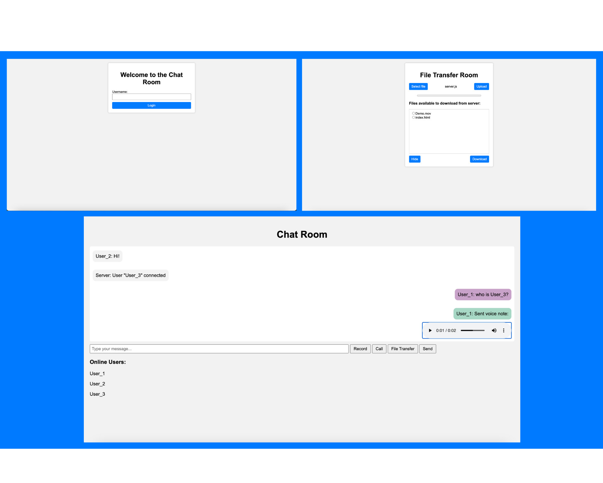

# Real time chatroom
## Client-server program with: chat, file upload/download, voice message and weather API functionality.

This project is an introductory project I undertook to learn and develop my web development skills. 
I undertook this project with very little webdev skills and I plan to update and expand existing code. This particular server-client chatroom has the following functionality:

* Socket.io and NodeJS chatroom with username and whisper functionality
* File to server upload using XHR (XMLHttpRequest)
* Download file with href download link
* Voice message are sent as blobs of data
* I use the OpenWeatherApp API to fetch weather informatin given a specific city
* Video chat functionality is coming soon

### Clone and cd realtime_chatroom
1. npm install, to install necessary dependancies
2. To run server:
    node server.js
3. To connect with client:
    localhost:3000 in browser

#### User functionality and overview:
1. Chatroom functionality
2. Duplicate usernames are not accpeted
3. User list updates dynamically
4. Whisper -> "/w username message"
5. File transfer (navigate to file transfer window)
    -> 1. clients can upload files to server
    -> 2. clients can download files from server
6. Voice message -> "click record to start and stop to end, follow on screen prompts"
7. Weather API -> "weather city_name" to receive tempreature and wind speeds of city

##### Coming soon!
1. Video calling
2. Interactive chatbot

##### BUGS:
- currently, a user can whisper to anything... 
    e.g. /w not_a_username hello void
- Messages currently have size limit
- When a voice message is cancelled, audio must stop playing...
